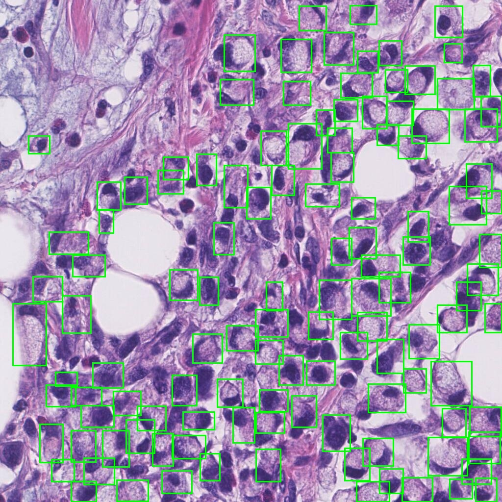
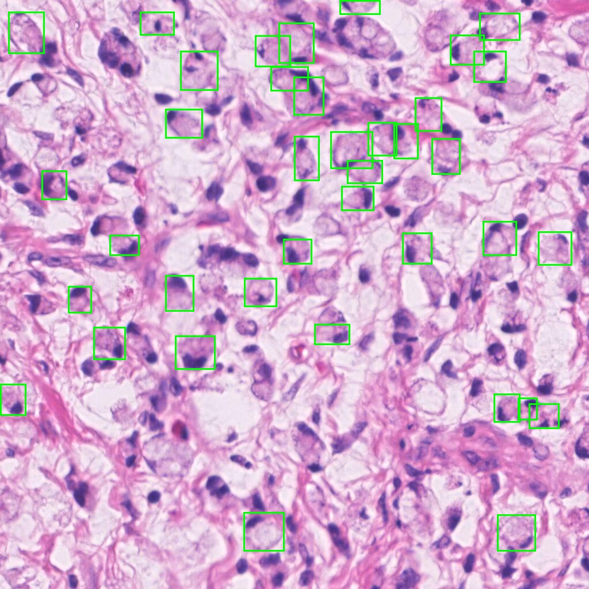
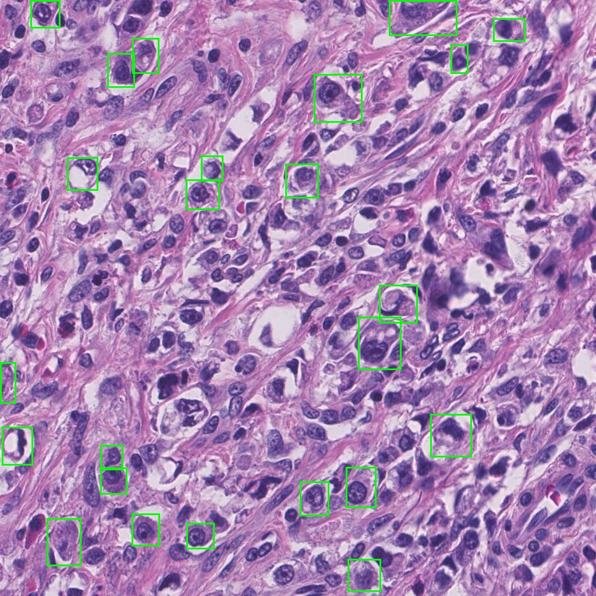
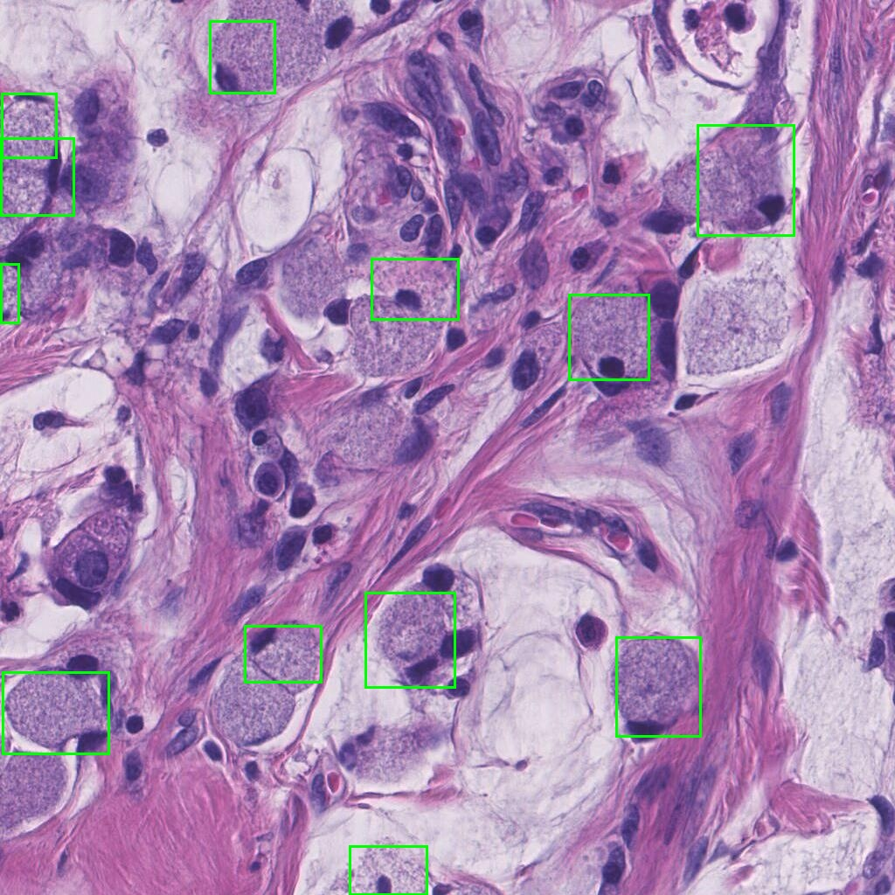

# 🔬 Signet Ring Cell Detection in Whole Slide Images using YOLO

> A deep learning pipeline for automated detection of **Signet Ring Cells (SRC)** in histopathology whole slide images using the latest YOLO object detection architecture.

[](https://www.python.org/)
[](https://docs.ultralytics.com/)
[](https://digestpath2019.grand-challenge.org/)
[]()

---

## Table of Contents

- [Background](#background)
  - [What is Object Detection?](#what-is-object-detection)
  - [What is SRC in Pathology?](#what-is-signet-ring-cell-src-in-pathology)
  - [SRC Detection in WSI](#src-detection-in-whole-slide-images)
  - [YOLO for Object Detection](#yolo-for-object-detection)
- [Dataset](#dataset)
  - [DigestPath Dataset](#digestpath-dataset)
  - [Dataset Structure](#dataset-structure)
  - [Dataset Audit Tools](#dataset-audit-tools)
- [Pipeline](#pipeline)
  - [Data Preparation](#data-preparation)
  - [YOLO Format Conversion](#yolo-format-conversion)
  - [Training](#training)
- [Project Structure](#project-structure)
- [Outputs](#outputs)

---

## Background

### What is Object Detection?

Object detection is a computer vision task that simultaneously **localises** and **classifies** objects within an image. Unlike image classification (which labels the whole image) or semantic segmentation (which labels every pixel), object detection produces **bounding boxes** around each detected instance along with a class label and confidence score.

In medical imaging, object detection enables pathologists to:
- Automatically locate and count cells of interest
- Quantify spatial distribution of structures across large tissue sections
- Flag regions of concern for further analysis

---

### What is Signet Ring Cell (SRC) in Pathology?

**Signet Ring Cells** are a morphologically distinct and clinically significant cell type in histopathology. They are characterised by:

- Large intracytoplasmic **mucin vacuoles** that displace the nucleus to the cell periphery
- A distinctive **crescent-shaped nucleus**, giving the cell a "signet ring" appearance under the microscope
- Strong association with **poorly differentiated adenocarcinomas**, particularly of the stomach, colon, and breast

> ⚠️ SRC carcinoma carries a **poor prognosis** — early and accurate detection is critical for clinical decision-making.

Manual identification of SRCs is:
- Time-consuming across large WSIs (often >100,000 × 100,000 pixels)
- Subject to inter-observer variability
- Impractical at scale in routine clinical workflows

---

### SRC Detection in Whole Slide Images

Whole Slide Images (WSIs) are gigapixel-scale digital scans of tissue sections. Detecting SRCs directly in a WSI presents several challenges:

| Challenge | Description |
|---|---|
| **Scale** | WSIs are too large to process as a single image |
| **Cell density** | SRCs are sparse and irregularly distributed |
| **Morphological variability** | SRC appearance varies across cancer types and staining protocols |
| **Class imbalance** | SRC-positive regions are rare compared to background tissue |

**Our approach** tiles each WSI into `512 × 512` pixel patches, applies YOLO-based object detection on each tile, and aggregates detections back to slide coordinates.

--- 

### Sample SRC Detections
|  |  |  |  |

> Green bounding boxes indicate detected Signet Ring Cells with confidence scores.

---

### YOLO for Object Detection

**YOLO (You Only Look Once)** is a family of real-time object detection models that predict bounding boxes and class probabilities in a single forward pass — making it significantly faster than two-stage detectors like Faster R-CNN.

#### YOLO Version Timeline

| Version | Year | Key Contribution |
|---|---|---|
| YOLOv1 | 2016 | First unified real-time detector |
| YOLOv2 / YOLO9000 | 2017 | Anchor boxes, multi-scale detection |
| YOLOv3 | 2018 | Multi-scale predictions, Darknet-53 |
| YOLOv4 | 2020 | CSPNet, PANet, mosaic augmentation |
| YOLOv5 | 2020 | PyTorch-native, widely adopted |
| YOLOv6 | 2022 | Efficient reparameterisation blocks |
| YOLOv7 | 2022 | E-ELAN, model scaling |
| YOLOv8 | 2023 | Anchor-free, Ultralytics ecosystem |
| YOLOv9 | 2024 | GELAN, PGI — programmable gradient information |
| YOLOv10 | 2024 | NMS-free end-to-end detection |
| **YOLO26 (latest)** | **2025** | **State-of-the-art accuracy and speed** |

**This project uses YOLO26** — the latest generation — available in four scales:

| Model | Scale | Speed | Best For |
|---|---|---|---|
| `yolo26n.pt` | Nano | Fastest | Edge / quick inference |
| `yolo26s.pt` | Small | Fast | Balanced performance |
| `yolo26m.pt` | Medium | Moderate | Good accuracy |
| `yolo26l.pt` | Large | Slower | **Highest accuracy** |

---
### Install Dependencies

```bash
pip install -r requirements.txt
```

Or  

```bash 
conda env create -f environment.yml
conda activate src_detection
```  
---
## Dataset

### DigestPath Dataset

We use the publicly available **DigestPath 2019** challenge dataset for SRC detection training and evaluation.

> 📥 **Download:** [https://digestpath2019.grand-challenge.org/Dataset/](https://digestpath2019.grand-challenge.org/Dataset/)

The dataset contains histopathology images from gastric and colon tissue with expert-annotated signet ring cells.

Alternatively, you can prepare your own dataset by:
1. Extracting `512 × 512` pixel tiles from WSIs using a tile extraction tool
2. Annotating SRC bounding boxes using [**LabelImg**](https://github.com/HumanSignal/labelImg) or [**Roboflow**](https://roboflow.com/)
3. Exporting annotations as XML files in Pascal VOC format

---

### Dataset Structure

After downloading, organise the DigestPath data as follows:

```
digestpath_dataset/
├── sig-train-neg/               ← Negative samples (no SRC annotations)
│   └── *.jpeg                   (varying sizes — background tissue only)
│
└── sig-train-pos/               ← Positive samples (contain SRC)
    ├── *.jpeg                   (varying sizes — paired with XML annotation)
    └── *.xml                    ← Pascal VOC bounding box annotations
```

#### Annotation XML Format (`sig-train-pos/*.xml`)

Each XML file contains bounding box coordinates for every annotated SRC in the corresponding image:

```xml
<annotation>
  <filename>image001.jpeg</filename>
  <size>
    <width>2000</width>
    <height>1500</height>
  </size>
  <object>
    <name>signet_ring_cell</name>
    <bndbox>
      <xmin>412</xmin>
      <ymin>308</ymin>
      <xmax>468</xmax>
      <ymax>364</ymax>
    </bndbox>
  </object>
</annotation>
```
---

### Dataset Audit Tools

Before training, audit and visualise your dataset using the scripts in `audit_dataset/`:

#### `audit_digestpath.py` — Overall Dataset Summary

Generates a high-level report across the full dataset including image counts, positive/negative split, annotation statistics, and missing file checks.

```bash
python audit_dataset/audit_digestpath.py
```

| | |
|---|---|
| **Input** | `input_folders/` |
| **Output** | `outputs/audit/audit_report.csv` |

---

#### `digestpath_box_stats.py` — Bounding Box Statistics

Analyses bounding box size distributions, cells-per-image counts, and aspect ratios across all positive samples.

```bash
python audit_dataset/digestpath_box_stats.py
```

| | |
|---|---|
| **Input** | `input_folders/sig-train-pos/` |
| **Output** | `outputs/stats/box_stats_summary.txt`, `outputs/stats/per_image_box_counts.csv` |

---

#### `visualize_digestpath_xml.py` — Visualise Annotations

Renders annotated images with bounding boxes overlaid for visual quality checking.

```bash
python audit_dataset/visualize_digestpath_xml.py
```

| | |
|---|---|
| **Input** | `input_folders/sig-train-pos/` |
| **Output** | `outputs/viz/` |

---

#### `visualize_yolo_tiles.py` — Visualise YOLO-format Tiles

Renders converted YOLO tiles with label overlays for verifying the format conversion.

```bash
python audit_dataset/visualize_yolo_tiles.py
```

| | |
|---|---|
| **Input** | `input_folders/images/train/`, `input_folders/labels/train/` |
| **Output** | `outputs/yolo_tile_viz/` |

---

## Pipeline

### Data Preparation

#### Step 1 — Convert DigestPath XML → YOLO Format

```bash
python convert_digestpath_to_yolo.py
```

This script reads all positive images and their XML annotations, converts bounding boxes to YOLO normalised format, splits the data into train/val sets, and writes the output dataset.

**Key paths** (edit at the top of the script):

```python
DATASET_ROOT = Path("/data_64T_1/.../digestpath_dataset")
POS_DIR      = DATASET_ROOT / "sig-train-pos"      # annotated images + XML
NEG_DIR      = DATASET_ROOT / "sig-train-neg"      # background images
OUT_ROOT     = Path(".../digestpath_yolo")          # YOLO-format output
IMG_OUT      = OUT_ROOT / "images"
LBL_OUT      = OUT_ROOT / "labels"
```

**Output structure after conversion:**

```
digestpath_yolo/
├── images/
│   ├── train/     ← training images
│   └── val/       ← validation images
├── labels/
│   ├── train/     ← YOLO .txt label files
│   └── val/
└── digestpath.yaml
```

**YOLO label format** — one line per object in each `.txt` file:

```
<class_id> <x_centre> <y_centre> <width> <height>
# All values normalised 0–1 relative to image dimensions
# Example:  0  0.512  0.384  0.028  0.031
```

---

### Training

#### Step 2 — Train YOLO26 on DigestPath

```bash
python train_yolo26_digestpath.py
```

> Model weights are **auto-downloaded** if not present in `models/`.

**Key training parameters:**

| Parameter | Value | Description |
|---|---|---|
| `model_name` | `models/yolo26l.pt` | Model scale — change to `n/s/m/l` |
| `imgsz` | `1024` | Input resolution during training |
| `epochs` | `100` | Total training epochs |
| `batch` | `8` | Batch size per GPU |
| `device` | `0` | GPU device index |
| `workers` | `16` | DataLoader worker processes |
| `seed` | `42` | Random seed for reproducibility |

**To train a different scale**, change `model_name`:

```python
model_name = "models/yolo26n.pt"   # nano  — fastest
model_name = "models/yolo26s.pt"   # small
model_name = "models/yolo26m.pt"   # medium
model_name = "models/yolo26l.pt"   # large — best accuracy
```

**Training outputs** are saved to:

```
runs_yolo2026/
└── digestpath_yolo26l_1024/
    ├── weights/
    │   ├── best.pt              ← best validation epoch checkpoint
    │   └── last.pt              ← final epoch checkpoint
    ├── args.yaml                ← full training configuration snapshot
    ├── results.png              ← loss and metric curves
    ├── PR_curve.png             ← precision-recall curve
    └── confusion_matrix.png     ← confusion matrix at threshold 0.5
```

---

## Project Structure

```
SRC_detection/
│
├── audit_dataset/
│   ├── audit_digestpath.py          ← Dataset-level audit and summary report
│   ├── digestpath_box_stats.py      ← Bounding box size and count statistics
│   ├── visualize_digestpath_xml.py  ← Annotated image visualisation
│   └── visualize_yolo_tiles.py      ← YOLO tile label visualisation
│
├── images/
│   ├── sample1_input.jpeg        ← raw tile, no annotations
│   ├── sample1_detection.jpeg    ← same tile with YOLO detections overlaid
│   ├── sample2_input.jpeg
│   └── sample2_detection.jpeg
│
├── models/
│   ├── yolo26l.pt                   ← Large  (auto-downloaded if missing)
│   ├── yolo26m.pt                   ← Medium
│   ├── yolo26s.pt                   ← Small
│   └── yolo26n.pt                   ← Nano
│
├── outputs/
│   ├── audit/
│   │   └── audit_report.csv         ← Dataset audit summary
│   ├── stats/
│   │   ├── box_stats_summary.txt    ← Bounding box statistics
│   │   └── per_image_box_counts.csv ← Per-image annotation counts
│   ├── viz/                         ← Annotated image samples (GT boxes)
│   └── yolo_tile_viz/               ← YOLO tile visualisations
│
├── runs/
│   └── detect/
│       └── val/                     ← Validation metrics: F1, P, R,
│                                       PR curve, confusion matrix
├── runs_yolo2026/
│   ├── digestpath_yolo26l_1024/           ← Large model training
│   ├── digestpath_yolo26l_1024_pred_val/  ← Large model val predictions
│   ├── digestpath_yolo26m_1024/           ← Medium model training
│   ├── digestpath_yolo26m_1024_pred_val/
│   ├── digestpath_yolo26s_1024/           ← Small model training
│   └── digestpath_yolo26s_1024_pred_val/
│
├── convert_digestpath_to_yolo.py    ← Pascal VOC XML → YOLO format converter
├── train_yolo26_digestpath.py       ← Training entry point
├── requirements.txt
└── README.md
```

---

## Outputs

| Output | Location | Description |
|---|---|---|
| Dataset audit report | `outputs/audit/audit_report.csv` | Image counts, annotation stats, missing file flags |
| Box statistics | `outputs/stats/box_stats_summary.txt` | SRC bounding box size distributions |
| Per-image counts | `outputs/stats/per_image_box_counts.csv` | Number of SRC per image |
| Annotation visualisations | `outputs/viz/` | Sample images with overlaid GT boxes |
| YOLO tile samples | `outputs/yolo_tile_viz/` | Tile images with YOLO label overlays |
| Best model weights | `runs_yolo2026/<run>/weights/best.pt` | Saved at best validation epoch |
| Training curves | `runs_yolo2026/<run>/results.png` | Loss, mAP, precision, recall over epochs |
| Confusion matrix | `runs_yolo2026/<run>/confusion_matrix.png` | Per-class detection confusion |
| PR curve | `runs_yolo2026/<run>/PR_curve.png` | Precision-Recall at varying thresholds |

---

<p align="center">
  Built for automated signet ring cell detection in histopathology whole slide images.
</p>
